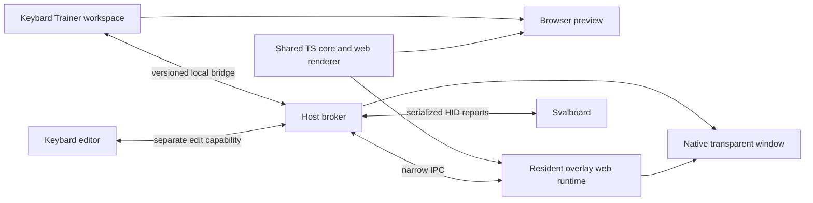

# Keybard Trainer and host companion

Status: architecture proposal, not an implementation or commitment to a desktop framework.
Date: 2026-10-05.

## Decision in brief

Make Trainer a Keybard workspace. Implement configuration, layout interpretation, practice behavior, and overlay rendering in shared TypeScript/React. Install one small host companion to supply the operating-system capabilities a browser cannot provide. The companion contains a packaged web renderer; it does not have a separate native settings interface.

The host must remain independently connected to the keyboard if the overlay is to survive closing Keybard's browser tab. “Minimal daemon” means minimal platform-specific responsibilities, not dependence on a foreground browser tab. It should be a per-user tray application, not a privileged system service.

Keep the existing Sval Trainer available and unchanged throughout migration. The prototype is a behavioral reference and source of test cases, not an application to refactor in place.

## Inspected sources and limits

- Keybard `origin/main` at `e7e9f3d`, fetched for this proposal. The proposal is isolated on `docs/overlay-host-architecture` in its own worktree. No application files changed.
- `src/App.tsx`: small navigation context with main, explore, and proof-sheet pages.
- `src/layout/Sidebar.tsx`, `SecondarySidebar/SecondarySidebar.tsx`, and `contexts/PanelsContext.tsx`: existing workspace/panel entry points.
- `src/components/Keyboard.tsx`, `Key.tsx`, and `layout/KeyboardViewInstance.tsx`: useful geometry/label/rendering concepts, but tied to editor selection, assignment, pending changes, and context menus.
- `src/services/fragment-composer.service.ts`, `utils/layers.ts`, and `constants/svalboard-layout.ts`: candidates for extracting pure layout/legend utilities.
- `src/services/usb.service.ts`: `SvilUSB` directly owns a browser `HIDDevice`, wrapper/session handling, and a request queue. `KeyboardContext` currently polls layer state approximately every 120 ms and exposes an active layer index. That index is insufficient for trainer resolution.
- Sval Trainer `7bfef64`: reference for full default masks, device identity, stale handling, keymap reads, appearance, held keys, and DPI recovery.
- Separate, unmerged context-companion worktree at `12bc55f`: Python Windows foreground adapter, context-layer engine, authenticated browser-extension bridge, and a native settings UI. This is a related migration candidate, not a dependency or assumed part of main.

Platform recommendations below are design choices. No macOS or Wayland feasibility claim is established by this document.

## Experience within Keybard

Add **Trainer** beside **Layouts** in the navigation, rather than hiding it in Settings or reusing Matrix Tester. Selecting it opens a dedicated workspace, accessible without a connected keyboard for imported-layout previews.

Use a large preview plus a bounded, scrollable inspector:

- **Overlay:** visibility, hands, scale, display, placement, arrange/click-through mode.
- **Appearance:** presets, independent fill/outline/legend RGBA, outline width, halo, separate pressed and layer-change colors.
- **Feedback:** layer transitions and duration; optional held-key highlighting.
- **Practice:** reference/recall, familiar bindings, cues, self-assessed results.

Persistent workspace actions: Show/hide desktop overlay, Arrange, connection state. Board selection reuses Keybard's connection experience; do not introduce another scan-first workflow. Display host readiness separately from keyboard readiness: “Host not installed,” “Paired,” “Board disconnected,” “Live,” “Preview,” or “Firmware capability unavailable.”

A live preview can switch between light, dark, patterned, and transparent backgrounds. It uses the same renderer as the native overlay. The desktop surface remains keyboard-only; pairing messages, practice instructions, stale warnings, and settings stay in Keybard. When live state becomes invalid, hide the live overlay rather than leave plausible but incorrect legends. An explicitly selected offline preview may remain visible.

Responsive inspector width should be capped, not additive to an already full-width keyboard editor. Stack preview and inspector on narrow screens, use internal vertical scrolling, and test long names at 440×500 and normal desktop sizes. Keep display placement local to the host; it cannot be meaningfully synchronized between unrelated monitor arrangements.

The tray exposes only recovery actions: Open Keybard, Show/hide, Arrange/stop arranging, and Quit. No second appearance/preferences UI. “Open Keybard” normally opens the hosted site; a packaged local Keybard control view provides the same UI offline or when browser-to-host connectivity is unavailable.

## Responsibilities

| Component | Owns | Does not own |
|---|---|---|
| Keybard web workspace | All controls, previews, practice, imports, user intent, visible diagnostics | OS window flags or privileged HID handles |
| Shared TypeScript trainer core | Binding resolution, geometry projection, labels, appearance schema, practice state, state validation | React editor contexts, OS APIs, arbitrary device writes |
| Shared web overlay renderer | SVG/DOM keyboard, colors, halo, animation, held keys | Browser WebHID, editor selection/remapping, native controls |
| Resident web runtime in companion | Executes the same core/renderer with applied configuration and board snapshots, independently of browser tabs | Separate copies of trainer behavior |
| Native host | HID access/serialization, bounded polling, reconnect, window lifecycle, displays/DPI, input pass-through, local bridge, persistence, updates | Layout editor, key-label formatting, theme logic, recall scoring |

Use an SVG renderer with bundled font assets and explicit geometry, including layer-source markers and transparent fills. Share this renderer between browser preview and host. Do not mount today's editor `Keyboard` component unchanged: it imports assignment/changes contexts and includes editor affordances. Extract pure geometry/label functions incrementally, then migrate other renderers later if useful.



The shared code is compiled into both web and companion releases. The browser does not stream pixels or continuously send computed legends to the host. Closing or suspending a browser tab therefore does not stop the overlay.

## Device transport and ownership

Extract a report-transport interface beneath existing protocol services. Initially wrap the existing `SvilUSB` behavior without rewriting all call sites. Keep binary encoding/decoding and layout assembly in shared TypeScript; keep browser/native handle management behind adapters.

Two operating modes:

1. **Browser-only Keybard:** existing WebHID transport, unchanged. Trainer preview works while the page is active; no desktop overlay promise.
2. **Companion-connected Keybard:** the host owns the selected Sval interface and serializes all local clients. Both the editor and trainer subscribe to this session. Do not silently retain the page's WebHID connection as a second owner.

The host enforces a trainer read-only command allowlist even if its client misbehaves. Polling recipes must be constrained to known read operations; “send arbitrary report” is not a trainer capability. Host-scheduled layer/matrix reads emit raw replies plus session/timing metadata for the shared TS codecs. Polling deadlines and stale watchdogs run in the host rather than browser timers. Stop optional matrix reads when disabled and pause unnecessary work while hidden.

Editor writes remain an explicit, separately authorized capability belonging to Keybard's existing editor. They are not exposed to the overlay renderer. Firmware flashing is outside this proposal. The scheduler must serialize an entire wrapped transaction, handle client leases, and avoid interleaving replies. Give state sampling predictable service without starving keymap transfers or editor operations; measure latency under load before choosing polling rates.

Migration into companion mode is a deliberate handoff: stop browser polling, drain/close its connection, acquire/verify the board in the host, then publish a fresh session. On failure, expose a reconnect action rather than assuming exclusive access or opening arbitrary alternatives. Keep wrapper client isolation for external tools, but do not use it as a substitute for coordination inside Keybard.

An Ubuntu VM sees its own USB and desktop session. A Windows host runner cannot place an overlay inside a VM desktop; install a Linux runner there and explicitly pass the board through when testing it. WSL tests do not establish native Linux desktop behavior.

## Applied data, not editor drafts

Maintain three distinct objects:

- **Board snapshot:** verified device identity, firmware capabilities, geometry, actual keymap, labels, and content revision/fingerprint.
- **Editor draft:** pending changes currently being edited in Keybard.
- **Trainer configuration:** appearance, feedback, practice options, selected board, manual legacy default mask, schema version.

The live trainer reads the board snapshot. It never consumes an editor draft merely because that object is currently in `KeyboardContext`. After a successful edit transaction, invalidate the affected applied data and read it back before labeling the updated snapshot verified. A partial write invalidates affected data as well. Offer explicit draft preview inside the web workspace, visibly distinguished from the live overlay.

External editors may not emit a change event. Offer Reload and define a bounded reconciliation strategy: use a firmware keymap revision if available; otherwise perform scheduled read-only verification when idle. Do not claim immediate detection without such a signal. A host cache allows fast startup but remains a cached preview until board identity and layout have been revalidated.

## Session and bridge contract

Use a versioned schema, shared generated types, runtime validation, and explicit capability negotiation. Suggested messages:

| Message | Purpose |
|---|---|
| `host.hello` | API versions, host/renderer build IDs, OS window capabilities |
| `device.select` / `device.status` | Select remembered identity, report connecting/live/disconnected/ambiguous state |
| `layout.snapshot` | Atomic verified board snapshot with revision |
| `device.state` | Active/default masks, matrix snapshot when enabled, sequence, session ID, layout revision, sample age |
| `trainer.configure` | Validated configuration with expected prior revision |
| `trainer.applied` | Acknowledge effective config revision or reject conflict |
| `overlay.show`, `overlay.arrange`, `overlay.place` | Narrow host window intents |
| `host.displays` / `host.status` | Effective display bounds, supported behaviors, errors |

Configuration updates are revisioned; the host stores and acknowledges the accepted configuration. Keybard reads it back on reconnect instead of overwriting newer settings from stale localStorage. Browser-only preferences can be imported explicitly on first pairing. Multiple tabs subscribe, but only a current revision can change the configuration. No account/cloud synchronization is required.

Live messages carry an opaque session ID and monotonic sequence. Device state references the layout revision it belongs to. Reconnect resets sequence/identity assumptions and renegotiates capabilities; discard late events from an old session. Do not compare absolute monotonic timestamps across the browser and host: transmit sample age or use local receipt deadlines, plus independent host and renderer heartbeat watchdogs.

Keep masks as unsigned 32-bit values. JavaScript bitwise operations are signed, so normalize explicitly (`>>> 0`) and test bit 31. Preserve all active/default bits, not just the highest layer. An unknown default is `null`, never inferred from old-firmware padding. Manual default selection applies only to legacy firmware/offline previews and must not overwrite remembered automatic state. Unknown referenced layers trigger a refresh and suspend live legends until resolved. Clear held keys on disconnect, stale samples, firmware rejection, and session changes.

Retain current transparency fallthrough and disabled-key stopping behavior, configurable layer/default-change animation, and self-assessed recall. Matrix samples are held-position snapshots, not guaranteed press events or automatic typing scores.

## Browser pairing and offline operation

Prefer an authenticated loopback bridge for the hosted Keybard site, with native IPC between the broker and its packaged renderer. Bind only loopback. Validate Host and exact allowed Origin, enforce message/schema/size limits, and use per-install pairing credentials with revocation. CORS alone is not authentication, and WebSocket Origin checking is not sufficient by itself.

First pairing uses a short-lived challenge and a host confirmation of the Keybard origin. Subsequent connections use scoped credentials. Do not put long-lived secrets in query strings, logs, or the keyboard. Browser-held credentials authorize trainer configuration/read subscriptions, not arbitrary native code, file access, or device writes. The optional context browser extension gets a distinct scope.

Browser local-network permissions and mixed-content rules are a feasibility gate, not an assumption. Test hosted HTTPS Keybard to loopback on intended browsers. A registered launch URI may wake the installed host but is not authentication. If a browser disallows the bridge, offer **Open local Keybard controls**, running the same packaged web UI through native IPC. A browser extension/native-messaging bridge can be an alternative later; avoid requiring it for basic overlay use.

The host renders packaged, versioned assets with a restricted content-security policy, not arbitrary remote pages with native privileges. Shared settings/data schemas negotiate compatibility independently of desktop package versions. Reject unsupported required features; show an update action in Keybard. Retain the last good configuration across failed updates. Start-up/autostart is opt-in; quitting the browser is distinct from quitting the companion.

## Framework and platform choice

First investigate a **Tauri/Rust host with a packaged React/SVG renderer**. It aligns with a small distribution and narrow native responsibilities. This is a candidate pending a deliberately small platform feasibility spike, not a reason to port the prototype now.

Tauri uses different system webviews across Windows, macOS, and Linux; identical React code alone does not ensure identical rendering. Bundle fonts, avoid engine-specific effects, test alpha/halo/text sizing on real platforms, and separate host capabilities from visual configuration. Its documented macOS transparency configuration requires special treatment and must be tested in a signed packaged application.

Keep **Electron as the fallback** if a consistent Chromium engine materially reduces rendering problems or the Tauri overlay spike fails. It can still be a small codebase with web-owned controls, but its distribution and process footprint are larger. Measure idle CPU/RAM, download size, update behavior, and state-to-paint latency rather than using framework reputation as evidence. Choose after the spike; the shared core/bridge/renderer architecture does not depend on this choice.

Windows and macOS need validated nonactivating, transparent, click-through topmost windows; native drag mode; monitor work-area placement; suspend/resume; and DPI/scale recovery. Preserve logical layout bounds across screen changes, with renderer-measured extents tagged by layout/config revision. Clamp saved positions if a display disappears. Do not size repeatedly from stale physical pixel measurements.

Linux must distinguish X11 from Wayland and identify the compositor. Wayland global placement/stacking may require a compositor-supported layer-shell path or other integration; a generic webview window cannot promise it. The early spike must include Ubuntu's intended session and Bazzite's actual session. Report unsupported placement/stacking capabilities in Keybard, not a control that silently does nothing. Ordinary desktop parity is the goal; fullscreen-exclusive games, secure desktops, lock screens, and every compositor are not a blanket guarantee.

The rendering and controls can be shared across all three OSes. The host integrations still need separate implementations and acceptance tests. macOS hardware is not currently available to the user, so require an external tester before claiming support.

## Relationship to the context companion

Aim for one host installation with isolated capabilities: overlay, device broker, and optional context observation. Do not immediately merge the Windows context draft or its native UI. Its foreground adapter and extension pairing experience are useful evidence; move eventual rule configuration into a separate **Context rules** Keybard workspace, not the Trainer inspector.

Trainer stays read-only. Context layer selection is separately enabled, has a separate protocol allowlist, and retains its firmware lease/fail-safe behavior. Context rules and evaluation can eventually live in shared code; native adapters supply foreground signals. Enabling the overlay must not enable context switching or app/browser observation.

There is a critical protocol distinction: the context draft resolves manual non-base layers before the host context layer, then base/default layers, independent of layer number. Its host contribution is not included in ordinary manual state. Consequently, OR-ing another bit into the trainer's existing mask is incorrect. Before integrating that feature, add an explicitly advertised read-only effective-resolution snapshot: either an ordered layer stack or separate masks/context data plus a versioned precedence model. Prefer firmware as the authority for the applied context. Never infer actual device resolution from the host's requested rule. The existing active/default-mask extension is sufficient for ordinary trainer use; it does not prove context-aware correctness.

## Proposed source layout

Start with a feature directory and narrow adapters; do not require converting all Keybard to a monorepo before showing value.

```text
src/
  pages/TrainerPage.tsx
  features/trainer/
    core/                 # pure resolution, appearance, practice, state reducer
    render/               # OverlaySurface, key glyphs, bundled styles/fonts
    controls/             # shared inspector and preview controls
    runtime/              # resident web entry and browser preview adapter
  services/host/
    client.ts             # pairing, version negotiation, reconnect, subscriptions
    contracts.ts          # runtime schemas and bridge types
  services/transport/
    report-transport.ts
    webhid-transport.ts
    host-transport.ts
companion/
  overlay-host/           # candidate Tauri host, packaging, OS adapters
  ...                     # context draft retained separately until explicit migration
tests/                    # use existing repo test conventions; no root rename needed
```

`TrainerPage` is registered through `App.tsx`; `Sidebar.tsx` gets its entry. `PanelsContext`/the details panel can host the inspector shell, but trainer state belongs in the feature, not `KeyBindingContext`. The overlay runtime must have its own minimal HTML/Vite entry and must not mount editor providers. Share schemas and assets through build imports; extract packages only when multiple consumers justify it.

## Migration sequence and acceptance gates

1. **Record prototype parity.** Fixtures from exported layouts, fragment geometry, masks, legacy capabilities, labels, and appearance. Preserve the working Python app and its release route. No device changes.
2. **Web-only Trainer workspace.** Shared resolver, renderer, configuration, and explicit offline/draft preview. Golden tests compare behavior with prototype fixtures. Check constrained-window layouts and live appearance controls. Existing editing tests stay green.
3. **Host feasibility spike, in parallel with web work if staffed.** Packaged keyboard-only surface; native transparency/click-through, native drag/DPI round-trip, signed macOS trial, X11/Wayland capability matrix, idle resource measurements, and hosted-browser pairing proof. Decide Tauri versus Electron here, before expensive migration.
4. **Read-only live host.** Remembered Sval identity, verified board snapshot, layer/default capability negotiation, optional matrix reads, browser-close survival, stale/reconnect behavior. Use host-mode Trainer before extending existing editor writes. If the editor still uses direct WebHID in this stage, require an explicit disconnect/handoff; no implied concurrent support.
5. **Unified Keybard transport.** Route existing editor operations through the host under a separate edit capability; commit/readback/revision events update the trainer. Test writes interleaved with polling, multi-tab clients, external tools, cancellation, suspend/resume, and failure during a partial edit. Browser-only WebHID remains a supported path.
6. **Distribution and migration.** Per-user installers, optional autostart, signed updates, protocol compatibility, preferences import, release notes, and Windows/macOS/Linux acceptance. Keep the standalone trainer until the integrated path meets parity and the user accepts it.
7. **Optional context consolidation.** Only after its own firmware and native behavior are validated; introduce effective-resolution reporting first. This is independent of replacing the trainer UI.

Test native focus/click-through with real applications, not screenshots or mocks. Test multiple attached boards, nonzero/multiple defaults including bit 31, geometry changes, disappearing monitors, disconnect/reconnect, stale packets, disabled matrix polling, conflicting settings tabs, unsaved editor changes, rejected origins, incompatible host versions, and closing the browser while the overlay remains live. Measure layer sample-to-paint latency under keymap transfer load. Set a provisional healthy-device p95 target of 100 ms and adjust only from hardware measurements; never call a stale overlay “live.”

The first implementation increment should be the **web-only Trainer workspace and shared rendering core**, plus an isolated host feasibility spike. This makes progress inside Keybard while keeping both native prototypes available.

## Platform references

- [Tauri webview versions](https://v2.tauri.app/reference/webview-versions/): system webview differences and platform deployment considerations.
- [Tauri configuration](https://v2.tauri.app/reference/config/): transparent windows and macOS configuration.
- [Electron BrowserWindow](https://www.electronjs.org/docs/latest/api/browser-window): window/input APIs and platform restrictions.
- [Chrome local network access](https://developer.chrome.com/blog/local-network-access): browser-to-loopback permission and evolving transport restrictions. Do not rely on a currently exempt transport remaining exempt.
- [Wayland layer-shell protocol](https://wayland.app/protocols/wlr-layer-shell-unstable-v1): compositor overlay surfaces; availability must be negotiated.
